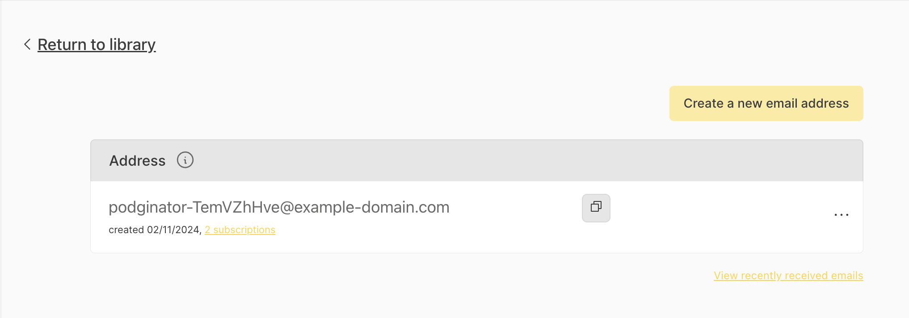
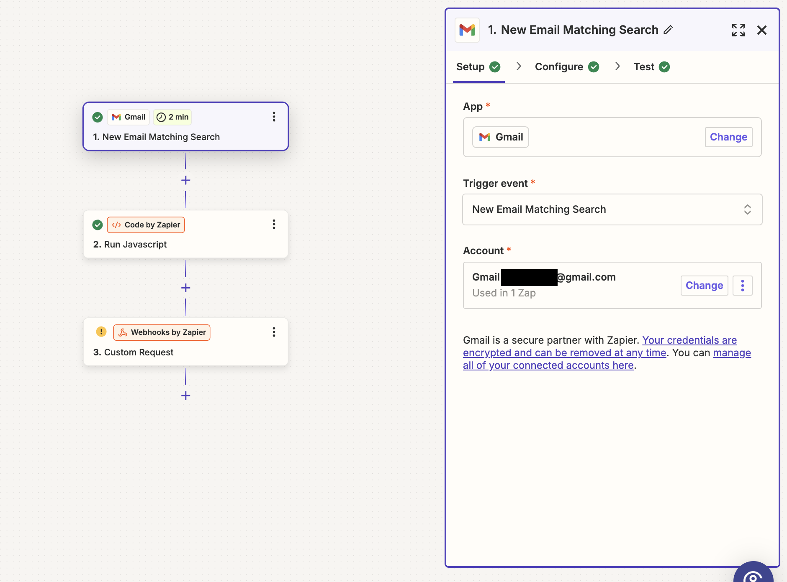

# Self Hosting

- [Docker Compose](#docker-compose)
- [Nginx Reverse Proxy](#nginx-reverse-proxy)
- [Cloudflare Tunnel](#cloudflare-tunnel)
- [Email](#email)
- - [Self Hosted Mail Server](#docker-mailserver-and-mail-watcher)
- - [Third Party Services](#third-party-services)

## Docker Compose

We recommend using Docker-compose for the simplest way to deploy Omnivore. We have provided a configuration in the `self-hosting/docker-compose` folder. 

All networking and persistent storage is handled by the docker-compose file.

### Requirements
* Docker 
* Docker Compose 

### 1. Clone the Repository

Clone the repository at ``git@github.com:omnivore-app/omnivore.git``

### 2. Change directory to self-hosting/docker-compose

The Docker-compose file and necessary environment variables are found in the self-hosting folder under docker-compose. 

These files provide all you need to get Omnivore up and running on your local environment. 

### 3. Populate the .env file 

There is a .env.example file located within the docker-compose folder that should give you the necessary environment variables to begin running. 
You can use these by `mv .env.example.env`

The following environment variables should be changed to reflect where you are running your application. 

| Environment Variable             | Description                                    | Local Parameter         |
|----------------------------------|------------------------------------------------|-------------------------|
| BASE URL                         | The URL of the Front End of the Application.   | http://localhost:3000   |
| SERVER_BASE_URL                  | The URL of the API Server.                     | http://localhost:4000   |
| HIGHLIGHTS_BASE_URL              | The URL of the Front end of the Application    | http://localhost:3000   |
| NEXT_PUBLIC_BASE_URL             | Same as above BASE URL, but for NEXT           | http://localhost:3000   |
| NEXT_PUBLIC_SERVER_BASE_URL      | Same as above SERVER_BASE_URL, but for NEXT    | http://localhost:4000   |
| NEXT_PUBLIC_HIGHLIGHTS_BASE_URL  | Same as above HIGHLIGHTS_BASE_URL but for NEXT | http://localhost:3000   |

Additionally, when doing a docker-compose build, if you are hosting this application you must change the args in the `docker-compose` file. 

```yaml
web:
    build:
    context: ../../
    dockerfile: ./packages/web/Dockerfile-self
args:
  - APP_ENV=prod
  - BASE_URL=http://localhost:3000
  - SERVER_BASE_URL=http://localhost:4000
  - HIGHLIGHTS_BASE_URL=http://localhost:3000
```

They are the same as the listed environment variables above. 

### 4. Build the docker images. 

Running `docker compose build` will go through and build all the necessary docker images. 

### 5. Start the service. 

Running `docker compose up` will start the services.

During the first deployment omnivore-migrate will go through and set up the necessary Postgres tables. 
This will also create a demo user with email: demo@omnivore.app, password: demo_password. 

When the service is ready you can access the web-app by using localhost:3000

With the default .env file you will be able to use Omnivore, add RSS Feeds, add stories etc. 


### Additional Services used: 

#### PGVector
A PGVector image is used to provide Postgres functionality. If you have another postgres service running it is possible to remove 
this from the docker-compose and provide the host, username and password of the Postgres instance. 

#### Redis 
Redis is used as a queueing system, and for caching. If you have a Redis Instance already it is possible to remove this from the docker-compose 
and rely on the hosted Redis. You must replace the redis url for this. 

#### Minio
Minio is an AWS S3 compatible Object storage service. It allows you to use the S3 Storage API. 

We also have a small client that creates the necessary buckets (createbuckets). See below: 
```bash
until (/usr/bin/mc config host add myminio http://minio:9000 minio miniominio) do echo '...waiting...' && sleep 1; done;
/usr/bin/mc mb myminio/omnivore;
/usr/bin/mc policy set public myminio/omnivore;
```

If you use GCS, or S3 buckets you can do the following:

##### S3: 
Replace the following with the correct parameters. 
```env
AWS_ACCESS_KEY_ID=minio   # Used for Minio S3 Client
AWS_SECRET_ACCESS_KEY=miniominio
AWS_REGION=us-east-1
```

Replace the following with an endpoint URL from [here](https://docs.aws.amazon.com/general/latest/gr/s3.html)
```env
LOCAL_MINIO_URL=http://localhost:1010

```

##### GCS: 
Remove the following Environment Variable: 
```env
GCS_USE_LOCAL_HOST=true
```
and populate 
```
GCS_UPLOAD_SA_KEY_FILE_PATH
```
with the path of the JSON key file for the service account.

## Nginx Reverse Proxy

Nginx is a reverse proxy that receives requests, and directs them to the correct service internally. Omnivore runs 4 services we want to redirect to.

* Omnivore Web
* Omnivore API
* Omnivore Bucket [Optional]
* Omnivore Image Proxy [Optional]

We have included an example Nginx Configuration that redirects traffic from http (80) to https (443), and then directs traffic to the correct service based on the request path. 

```nginx
events {}

http {
    sendfile    on;
    keepalive_timeout 60;

     upstream omnivore_web {
    	ip_hash;
    	server 127.0.0.1:3000;
     }

     upstream omnivore_backend {
    	ip_hash;
    	server 127.0.0.1:4000;
     }

     upstream omnivore_imageproxy {
    	ip_hash;
    	server 127.0.0.1:1010;
     }

    upstream omnivore_bucket {
    	ip_hash;
    	server 127.0.0.1:7070;
    }

    server {
        listen 80;
        return 301 https://$host$request_uri
    }

    server {
        listen 443;
        server_name  omnivore.domain.com;


        ssl_certification   /path/to/cert.crt;
        ssl_certificate_key /path/to/cert.key;

        ssl on;
        ssl_session_cache builtin:1000 shared:SSL:10m;
        ssl_protocols TLSv1 TLSv1.1 TLSv1.2;
        ssl_ciphers HIGH:!aNULL:!eNULL:!EXPORT:!CAMELLIA:!DES:!MD5:!PSK:!RC4;
        ssl_prefer_server_ciphers on;

        # Override for authentication on the frontend
        location /api/client/auth {
            proxy_pass http://omnivore_web;
        }

        # API
        location /api {
            proxy_pass http://omnivore_backend;
        }

        # Minio
        location /bucket {
            proxy_pass http://omnivore_bucket;
        }

        # ImageProxy
        location /images {
            proxy_pass http://omnivore_imageproxy;
        }

        # FrontEnd application
        location / {
            proxy_pass http://omnivore_web;
        }
        
        location /mail {
            proxy_pass http://localhost:4398/mail;
        }
    }
}
```

## Cloudflare Tunnel
Cloudflare tunnels is an easy way to expose a service running on a local machine to the internet without a publicly routable IP Address. 

You run a daemon on your host machine, which creates outbound connections to the


Omnivore is no way affiliated with Cloudflare, it is just the method to which the person writing this guide used, and found pretty painless overall.

[Read More](https://www.cloudflare.com/products/tunnel/)


## Emails and Newsletters

Another Feature of Omnivore is the ability to receive Newsletters directly into your Inbox using email. This feature is described more [here](#receiving-newsletter-subscriptions-via-email).

This works by generating an email address, and subscribing to a newsletter using that email address. 

In order to get this working in a self-hosted way we have created a new endpoint that allows you to send an API request with the emails contents.  

We will go over 

#### Receiving Newsletter Subscriptions via Email
1. On the Omnivore website or app, tap your photo, initial, or avatar in the top right corner to access the profile menu. Select Emails from the menu.

2. Tap Create a New Email Address to add a new email address (e.g. username-123abc@inbox.omnivore.app) to the list.

3. Click the Copy icon next to the email address.

4. Navigate to the signup page for the newsletter you wish to subscribe to.

5. Paste the Omnivore email address into the signup form.

6. New newsletters will be automatically delivered to your Omnivore inbox.

### Docker-mailserver and mail-watcher

One way to get this functionality back is to host your own mail server. In this example we will only be using this mail server as an incoming mailbox to receive emails. I would not recommend this method, as it's largely more effort  than it is worth.  

We have used [Docker-mailserver](https://docker-mailserver.github.io) here. A guide on how to set this up is found [here](https://docker-mailserver.github.io/docker-mailserver/latest/examples/tutorials/basic-installation/). 

We have included a docker file `self-hosting/docker-compose/mail/docker-compose-mail`. This file does a few things.

* Setups Docker-mailserver with minimal settings. 
* Creates a user `user@domain.tld` where `domain.tld` is your email servers domain. 
* Reroutes all mail from `*@domain.tld` to `user@domain.tld`
* Watches for any new mail incoming, converts it to a payload for the mail proxy, and forwards it on. 

There are a few environment variables that need to be set. 

```.env
WATCHER_API_KEY=mail-api-key # The API Key that runs the mail-watcher-api 
MAIL_FILE_PATH=/var/mail/domain.tld/user/new # where domain.tld is the name of your domain
WATCHER_API_ENDPOINT=https://omnivore-watch.domain.tld # The hosted watcher api - where mail is proxied to and processed.
```

Additionally you need to change a few things in the docker-file. 

```
hostname: mail.domain.tld
```
```
    environment:
      - DOMAIN="domain.tld"
```
```
docker exec -ti mailserver setup email add user@domain.tld pass123;
echo '@domain.tld user@domain.tld' > /tmp/docker-mailserver/config/postfix-virtual.cf
```
replace domain.tld with your mail servers domain. 

Additionally you need to replace the following environment variables for the API. 

```
WATCHER_API_KEY=mail-api-key # The same as the one in the mail server.
LOCAL_EMAIL_DOMAIN=domain.tld # Your email domain.
```

### Third Party Services
Setting up your own email server is a bit overkill for what we are trying to achieve. Below are some additional services that can be used to achieve the mail functionality. These are just a few examples, but others will also work.

#### Amazon Simple Email Service and SNS 

#### Zapier and other Webhook Services. 

If you are just looking for a simple way to import emails into your Self Hosted Omnivore Account, you can use a service like Zapier to forward the email into the mail-proxy. 

Below is a set of instructions to get this working. 

##### Step 1. Create an Omnivore Email 


##### Step 2. Create a Zapier Integration, using Gmail or Equivalent
You can either use your own email with a filter, or alternatively create a new gmail account exclusively for your Newsletters.


##### Step 3. Convert Email into Payload for Webhook. 


For the to object use the email provided in step 1. 

```javascript
return { data: JSON.stringify(inputData) }
```

##### Step 4. Send to Mail Proxy. 

* POST Request
* Use the x-api-key set in your .env file 
* The data is the output from the previous step. 

##### Email Imported

Following these steps you should see your email imported into Omnivore. 


